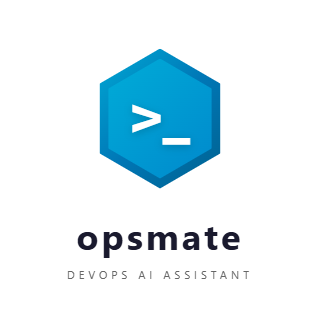

<p align="center">
  <picture>
    <source media="(prefers-color-scheme: dark)" srcset="docs/assets/logo-dark.png">
    <source media="(prefers-color-scheme: light)" srcset="docs/assets/logo.png">
    
  </picture>
</p>

<h1 align="center">opsmate</h1>

<p align="center">
  <strong>One command to give Claude Code full understanding of your infrastructure</strong>
</p>

<p align="center">
  <a href="https://github.com/paffin/opsmate/releases"></a>
  <a href="https://github.com/paffin/opsmate/actions"></a>
  <a href="https://goreportcard.com/report/github.com/paffin/opsmate"></a>
  <a href="https://opensource.org/licenses/MIT"></a>
  <a href="https://github.com/paffin/opsmate/stargazers"></a>
</p>

<p align="center">
  <code>opsmate</code> launches <a href="https://modelcontextprotocol.io/">MCP servers</a> that connect Claude Code directly to Kubernetes, Docker, Prometheus, and your infra files.<br>
  <strong>30 DevOps tools. Zero copy-paste. Single binary.</strong>
</p>

<br>

<p align="center">
  
</p>

<br>

## Why?

You're debugging a production incident at 2 AM. You switch between `kubectl`, Prometheus dashboards, Docker logs, and ChatGPT — copy-pasting context back and forth. The AI doesn't know your cluster state. You waste precious time explaining what you're looking at.

**opsmate fixes this.** One command — and Claude Code can see your pods, query your metrics, read your logs, and lint your configs. It acts on live infrastructure, not stale copy-paste.

```bash
$ opsmate
  opsmate — DevOps AI Assistant

  MCP Servers:
  ✔ kubernetes (context: production)
  ✔ docker (readonly)
  ✔ prometheus (http://prometheus:9090)
  ✔ file-analyzer

  Launching Claude Code with DevOps superpowers...
```

Then just ask:

```
> Why is pod nginx-7b5f9 crashing?

I'll investigate the pod failure.

[k8s_get_pods]      → nginx-7b5f9: CrashLoopBackOff (7 restarts)
[k8s_get_pod_logs]  → "Killed" — OOMKilled
[k8s_describe]      → limits.memory: 128Mi
[prom_query]        → container_memory_usage: ~240Mi

Root cause: The container exceeds its 128Mi memory limit.

Recommended fix:
  kubectl set resources deployment/nginx --limits=memory=512Mi

Apply this fix? [y/N]
```

## Chat UI

opsmate includes a built-in web chat interface — your own ChatGPT-like UI powered by Claude Code under the hood. Uses your Claude Pro/Max subscription, not API keys.

```bash
$ opsmate chat
  opsmate chat — Web Chat UI

  Listening on http://localhost:8080
```

- Dark terminal-style theme (Tokyo Night)
- Real-time streaming responses via WebSocket
- Markdown rendering with syntax highlighting
- Tool usage indicators (see when Claude uses MCP tools)
- Multi-turn conversations with session persistence
- `>` prompt — just like the terminal, but in your browser

```bash
opsmate chat              # Start on default port 8080
opsmate chat --port 3333  # Custom port
```

## Install

```bash
# Go install (recommended)
go install github.com/paffin/opsmate/cmd/opsmate@latest

# Or download binary
curl -sSL https://raw.githubusercontent.com/paffin/opsmate/main/scripts/install.sh | bash

# Or build from source
git clone https://github.com/paffin/opsmate && cd opsmate && go build -o opsmate ./cmd/opsmate
```

**Prerequisites:** [Claude Code](https://docs.anthropic.com/en/docs/claude-code) installed and authenticated.

## 30 Tools Across 4 Domains

<table>
<tr>
<td width="50%" valign="top">

### Kubernetes (11 tools)

| Tool | What it does |
|------|-------------|
| `k8s_get_pods` | List pods with status |
| `k8s_get_pod_logs` | Read pod logs |
| `k8s_describe` | Describe any resource |
| `k8s_get_events` | Cluster events |
| `k8s_get_nodes` | Node status & resources |
| `k8s_get_deployments` | Deployment status |
| `k8s_get_services` | Services & endpoints |
| `k8s_apply` | Apply YAML manifest* |
| `k8s_scale` | Scale deployment* |
| `k8s_rollout_status` | Rollout progress |
| `k8s_top` | CPU/memory usage |

</td>
<td width="50%" valign="top">

### Docker (8 tools)

| Tool | What it does |
|------|-------------|
| `docker_ps` | List containers |
| `docker_logs` | Container logs |
| `docker_inspect` | Container details |
| `docker_stats` | Resource usage |
| `docker_images` | List images |
| `docker_compose_ps` | Compose status |
| `docker_compose_logs` | Compose logs |
| `docker_exec` | Run command* |

</td>
</tr>
<tr>
<td width="50%" valign="top">

### Prometheus (7 tools)

| Tool | What it does |
|------|-------------|
| `prom_query` | Instant PromQL query |
| `prom_query_range` | Range query |
| `prom_alerts` | Firing alerts |
| `prom_targets` | Scrape targets |
| `prom_rules` | Alert/recording rules |
| `prom_series` | Find time series |
| `prom_label_values` | Label values |

</td>
<td width="50%" valign="top">

### File Analyzer (4 tools)

| Tool | What it does |
|------|-------------|
| `file_analyze` | Analyze infra file |
| `file_lint` | Best practices check |
| `file_validate` | Syntax validation |
| `file_scan_dir` | Find infra files |

**Built-in lint rules for:**
Dockerfile, Kubernetes YAML, Docker Compose, Terraform

</td>
</tr>
</table>

<sub>* Destructive operations require confirmation and can be disabled with <code>--readonly</code></sub>

## Real-World Scenarios

<details>
<summary><strong>Scenario 1:</strong> "Why is my pod crashing?"</summary>

```
> My nginx deployment keeps restarting, help me figure out why

Claude: Let me investigate...
[k8s_get_pods]     → Found pod nginx-7b5f9 in CrashLoopBackOff
[k8s_get_pod_logs] → OOMKilled detected
[k8s_describe]     → limits.memory: 128Mi
[prom_query]       → container_memory_usage avg: 240Mi

Root Cause: OOMKilled — container uses ~240Mi but limit is 128Mi

Recommended actions:
1. Increase memory limit: kubectl set resources deploy/nginx --limits=memory=512Mi
2. Check for memory leaks in nginx config

Apply fix #1? [y/N]
```
</details>

<details>
<summary><strong>Scenario 2:</strong> "Audit my Dockerfile"</summary>

```
> Analyze the Dockerfile in ./app/

Claude: Let me review it...
[file_lint ./app/Dockerfile]

Found 5 issues:
  [!] CRITICAL: Running as root (no USER instruction)
  [~] WARNING:  Using latest tag (FROM node:latest)
  [~] WARNING:  No HEALTHCHECK defined
  [i] INFO:     Consider multi-stage build to reduce image size
  [i] INFO:     .dockerignore not found

Want me to generate a fixed version?
```
</details>

<details>
<summary><strong>Scenario 3:</strong> "Give me a cluster overview"</summary>

```
> Show me what's happening in production

Claude: Collecting cluster status...
[k8s_get_nodes]  → 3 nodes, all Ready
[k8s_top nodes]  → CPU: 45%, Memory: 62%
[k8s_get_pods]   → 47 pods, 2 not Running
[prom_alerts]    → 1 firing: HighMemoryUsage on node-2

Cluster Overview:
  Nodes:  3/3 healthy (CPU: 45%, Mem: 62%)
  Pods:   45/47 running (2 pending in staging)
  Alerts: 1 firing — HighMemoryUsage on node-2 (87%)

node-2 memory is at 87%. Want me to investigate which pods
are consuming the most memory?
```
</details>

## How It Works

```
                        ┌──────────────────┐
                        │   opsmate CLI    │
                        │   (single Go     │
                        │    binary)       │
                        └────────┬─────────┘
                                 │
                    ┌────────────┴────────────┐
                    │                         │
               opsmate (CLI mode)       opsmate chat (Web UI)
               generates .mcp.json      WebSocket server +
               launches Claude Code     embedded Chat UI
                    │                         │
               ┌────┴────────────────────┐    │
               ▼         ▼              ▼    ▼
        ┌──────────┐ ┌──────────┐ ┌──────────┐
        │ K8s MCP  │ │Docker MCP│ │ Prom MCP │  ...
        │ (stdio)  │ │ (stdio)  │ │ (stdio)  │
        └────┬─────┘ └────┬─────┘ └────┬─────┘
             ▼            ▼            ▼
        K8s Cluster  Docker Host  Prometheus
```

**CLI mode** (`opsmate`):
1. Reads config from `~/.opsmate/config.yaml`
2. Generates `.mcp.json` pointing to `opsmate mcp <server>` subcommands
3. Injects DevOps system prompt via `CLAUDE.md`
4. Launches `claude` CLI — which spawns MCP servers as needed
5. Each MCP server communicates over **stdio** — no ports, no API keys
6. On exit — clean up `.mcp.json` and `CLAUDE.md` markers

**Chat UI mode** (`opsmate chat`):
1. Same MCP config generation as CLI mode
2. Starts a local HTTP server with embedded web frontend
3. Browser connects via WebSocket to the server
4. Each message runs `claude -p --output-format stream-json` with MCP config
5. Responses stream back in real-time through the WebSocket
6. Session IDs enable multi-turn conversations via `--resume`

## Safety First

| Feature | Description |
|---------|-------------|
| **Read-only mode** | `--readonly` disables apply, scale, delete, exec |
| **Confirmation prompts** | Destructive ops require explicit approval |
| **Secret redaction** | Passwords, tokens, keys masked in output |
| **Namespace restrictions** | Limit K8s access to specific namespaces |
| **Log limits** | Prevents OOM from massive log outputs |
| **No network exposure** | MCP servers use stdio, not HTTP |

## Configuration

<details>
<summary>~/.opsmate/config.yaml</summary>

```yaml
servers:
  kubernetes:
    enabled: true
    kubeconfig: ~/.kube/config
    context: ""                    # empty = current context
    namespaces: []                 # empty = all
    readonly: false

  docker:
    enabled: true
    host: unix:///var/run/docker.sock
    readonly: true                 # safe default

  prometheus:
    enabled: false                 # enable when needed
    url: http://localhost:9090

  files:
    enabled: true
    scan_paths: ["."]
    rulesets: [dockerfile, kubernetes, compose, terraform]

safety:
  confirm_destructive: true
  max_log_lines: 1000
  redact_secrets: true

claude:
  model: claude-sonnet-4-20250514
```

</details>

## vs. Alternatives

| | opsmate | kubectl + ChatGPT | k9s | Lens |
|---|:---:|:---:|:---:|:---:|
| AI-powered analysis | **Yes** | Manual copy-paste | No | No |
| Live cluster context | **Yes** | No | Yes | Yes |
| Docker + Prometheus | **Yes** | No | No | Plugin |
| Infrastructure linting | **Yes** | No | No | No |
| Natural language | **Yes** | Yes | No | No |
| Safety guardrails | **Yes** | -- | Partial | Partial |
| Single binary | **Yes** | -- | Yes | No |
| Open source | **MIT** | -- | Apache-2 | Freemium |

## Roadmap

- [x] Kubernetes MCP server (11 tools)
- [x] Docker MCP server (8 tools)
- [x] Prometheus MCP server (7 tools)
- [x] File analyzer with lint rules (4 tools)
- [x] Web Chat UI with streaming responses
- [ ] Terraform MCP server (plan, apply, state)
- [ ] Ansible MCP server (playbook, inventory)
- [ ] `opsmate doctor` — diagnose environment issues
- [ ] `opsmate init` — interactive setup wizard
- [ ] Plugin system for custom MCP servers
- [ ] Helm chart for in-cluster deployment
- [ ] Grafana MCP server
- [ ] CI/CD pipeline MCP (GitHub Actions, GitLab CI)

## Contributing

We love contributions! Whether it's a new MCP server, a lint rule, or a bug fix.

```bash
git clone https://github.com/paffin/opsmate
cd opsmate
go build ./...
go test ./...
```

Each MCP server is self-contained in `mcp/<name>/` with three files: `server.go`, `tools.go`, `handlers.go`. See [CONTRIBUTING.md](docs/contributing.md) for detailed guidelines.

## License

[MIT](LICENSE)

---

<p align="center">
  <sub>Built with <a href="https://github.com/mark3labs/mcp-go">mcp-go</a> and <a href="https://docs.anthropic.com/en/docs/claude-code">Claude Code</a></sub>
</p>

<p align="center">
  <strong>If opsmate helps you during an incident, consider giving it a star</strong>
</p>
